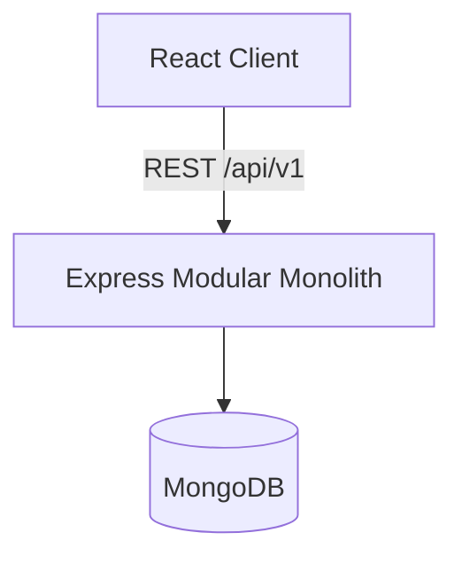
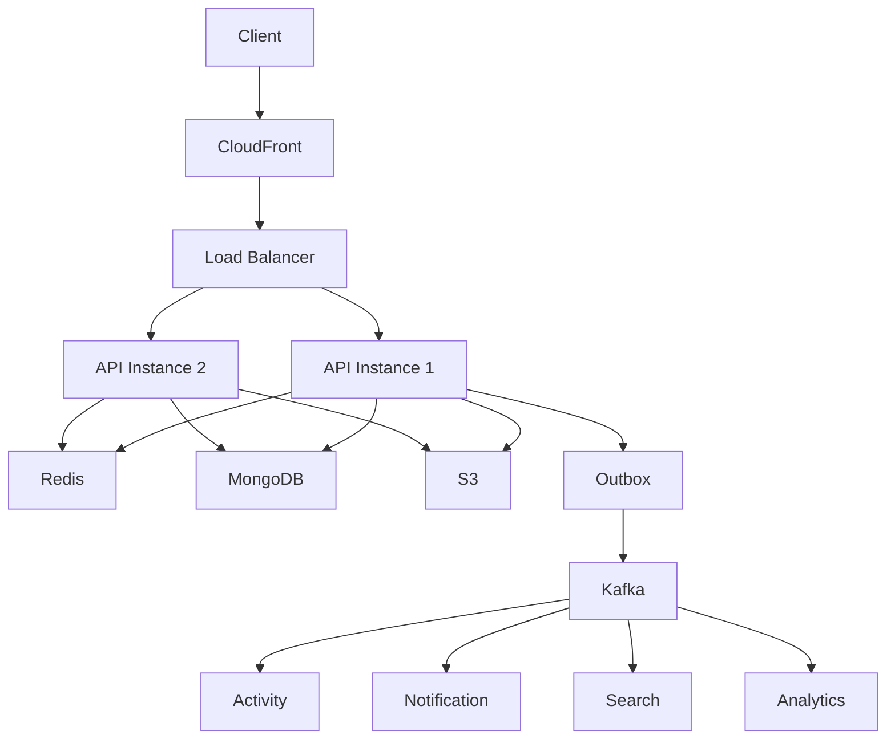

# 01 — System Overview

## What is FlowHub?

FlowHub is a collaborative project and workflow management platform. Users belong to organizations, work inside workspaces, manage projects, create and assign tasks, comment, and eventually collaborate in real time with notifications, activity feeds, and search.

FlowHub is also a **hands-on system-design laboratory**. Features are introduced only when they solve a concrete problem, so each architectural component has a clear "why."

## Dual Purpose

| Goal | Meaning |
|------|---------|
| Production quality | Maintainable, testable, secure, observable, type-safe code |
| Learning | Every major component teaches a system-design concept |

## Current Stage

**Phase 0–1 complete: Modular Monolith running (React → Express → MongoDB)**

```
React Client
     ↓
Node.js / Express API (modular monolith)
     ↓
MongoDB
```

Later phases add Redis, horizontal scaling, WebSockets, queues, Kafka, outbox, search, CQRS, observability, and eventually selective microservice extraction. See [ROADMAP.md](./ROADMAP.md).

## High-Level Architecture (Phase 1)



## Target End-State (Do Not Build Yet)



This diagram is a **destination**, not a starting point. Building it prematurely would hide the problems each component solves.

## Design Principles

1. **Modular monolith first** — clear domain boundaries without network overhead.
2. **Problem-driven technology** — introduce Redis/Kafka/etc. only when a real bottleneck or correctness need appears.
3. **Stateless API** — enable horizontal scaling later without redesign.
4. **Fail explicitly** — validate config at startup; surface errors consistently.
5. **Document decisions** — ADRs capture context, options, and trade-offs.

## Related Documents

- [02-domain-model.md](./02-domain-model.md)
- [03-database-design.md](./03-database-design.md)
- [04-api-design.md](./04-api-design.md)
- [00-architecture-fundamentals.md](./00-architecture-fundamentals.md)
- [ROADMAP.md](./ROADMAP.md)
- [adr/](./adr/)
