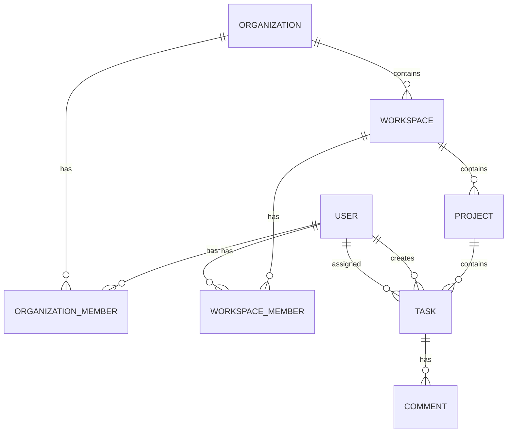

# 02 — Domain Model

## Hierarchy

```
User
 └─ Organization
     └─ OrganizationMember (role)
         └─ Workspace
             └─ WorkspaceMember (role)
                 └─ Project
                     └─ Task
                         ├─ Comment
                         ├─ Activity (system-generated)
                         └─ Notification (user-targeted)
```

## Entities (Phase 1)

### User
Identity and credentials. Auth-sensitive fields (`passwordHash`) never leave the API.

| Field | Notes |
|-------|-------|
| `_id` | ObjectId |
| `email` | Unique, normalized lowercase |
| `name` | Display name |
| `passwordHash` | bcrypt; never returned in API |
| `avatarUrl` | Optional |
| `status` | `active` \| `disabled` |
| `createdAt` / `updatedAt` | Timestamps |

### Organization
Company/team boundary for billing and membership later.

### OrganizationMember
Join table: `(organizationId, userId)` + role (`OWNER` \| `ADMIN` \| `MEMBER`).

**Why separate collection?** Membership cardinality is many-to-many; roles and queries ("list my orgs") are cleaner as references than embedding large member arrays in the org document.

### Workspace
Working area inside an organization. Multiple workspaces per org (e.g., Engineering, Marketing).

### WorkspaceMember
Workspace-scoped access. A user may be org MEMBER but not in every workspace.

### Project
Belongs to a workspace. Holds tasks.

### Task
Primary work item. Stores `projectId` and `workspaceId` (denormalized) for query patterns without joins.

### Comment
Belongs to a task; stores `authorId`, `content`, optional `mentionUserIds`.

### Activity / Notification
Modeled in Phase 1 as collections written from the API. Later they become **event consumers** (event-driven architecture).

## Relationships Diagram



## Authorization Model (Phase 1)

1. Authenticate user (JWT access token).
2. Resolve membership for org/workspace.
3. Enforce role on mutating operations.

Resource-level checks live in services, not only in route handlers.

## Deferred

- Subtasks, dependencies, labels as first-class entities
- File attachments (S3 + metadata)
- Full notification preferences
- Soft deletes / archival policies (document when introduced)
