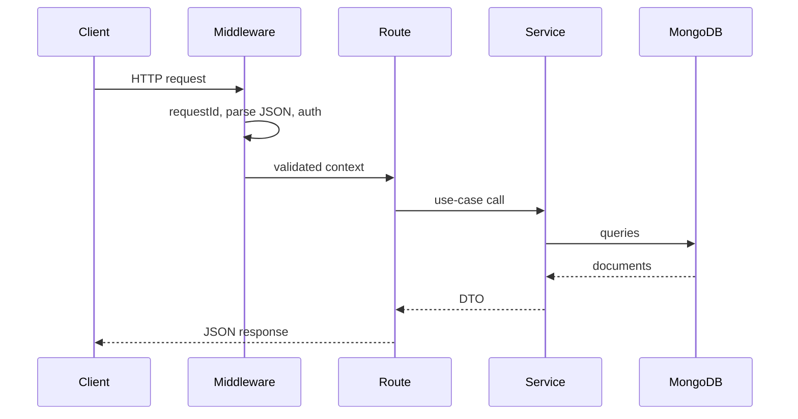

# 04 — API Design

## Style

REST, versioned under `/api/v1`.

## Conventions

| Concern | Approach |
|---------|----------|
| Versioning | URL prefix `/api/v1` |
| Errors | Consistent JSON: `{ error: { code, message, requestId } }` |
| Auth | `Authorization: Bearer <accessToken>` |
| Pagination | Offset for Phase 1; cursor later where needed |
| Filtering / sorting | Query params (`status`, `sort`, `order`) |
| Request ID | Middleware assigns/propagates `X-Request-Id` |
| Validation | Zod schemas at the HTTP boundary |
| Business logic | Services — not route handlers |

## Core Endpoints (Phase 1)

### Auth
- `POST /api/v1/auth/register`
- `POST /api/v1/auth/login`
- `POST /api/v1/auth/refresh`
- `POST /api/v1/auth/logout`

### Organizations
- `POST /api/v1/organizations`
- `GET /api/v1/organizations`
- `GET /api/v1/organizations/:id`
- `POST /api/v1/organizations/:id/members`

### Workspaces
- `POST /api/v1/organizations/:orgId/workspaces`
- `GET /api/v1/organizations/:orgId/workspaces`
- `GET /api/v1/workspaces/:id`
- `POST /api/v1/workspaces/:id/members`

### Projects
- `GET /api/v1/workspaces/:workspaceId/projects`
- `POST /api/v1/workspaces/:workspaceId/projects`
- `GET /api/v1/projects/:id`
- `PATCH /api/v1/projects/:id`
- `DELETE /api/v1/projects/:id`

### Tasks
- `GET /api/v1/projects/:projectId/tasks`
- `POST /api/v1/projects/:projectId/tasks`
- `GET /api/v1/tasks/:id`
- `PATCH /api/v1/tasks/:id`
- `DELETE /api/v1/tasks/:id`

### Comments
- `GET /api/v1/tasks/:taskId/comments`
- `POST /api/v1/tasks/:taskId/comments`

## Request Lifecycle (Phase 1)

## Idempotency

Not required on all POSTs in Phase 1. We will add idempotency keys for selected writes when clients retry aggressively (distributed systems learning).

## Rate Limiting

In-memory / simple limiter acceptable only for single-instance Phase 1–2. Distributed Redis rate limiting arrives in Phase 3.
