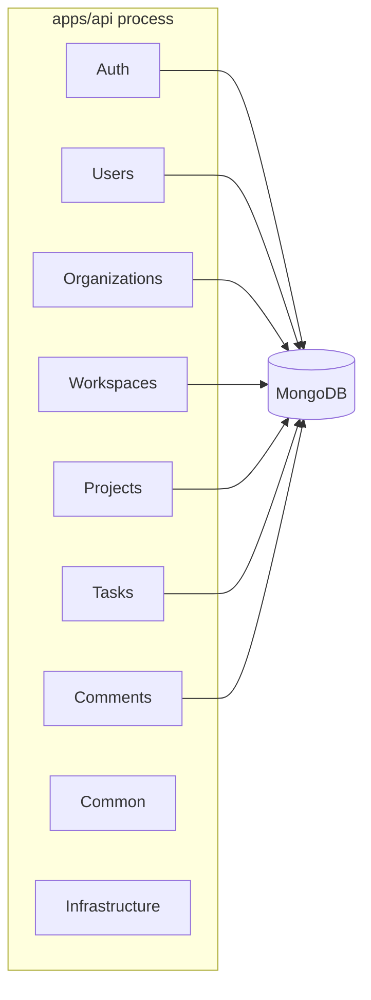

# Modular Monolith Structure (Phase 1)

## Deployable shape

One Node.js process. One MongoDB database. Domain modules co-located but separated by folder and responsibility.

## Module rules

1. Routes → thin controllers → services → models
2. Authorization lives in services / access helpers
3. Prefer importing models and shared helpers across modules, not each other's services
4. Infrastructure (Mongo, logging) is shared; domains do not own connection logic

## Why this matters for later extraction

When we extract Notification or Search services (Phase 19), we should already have:

- Clear ownership of collections
- Explicit APIs between domains
- Events at boundaries (introduced earlier via outbox/Kafka)

Extraction then becomes cutting a module out — not inventing boundaries under pressure.